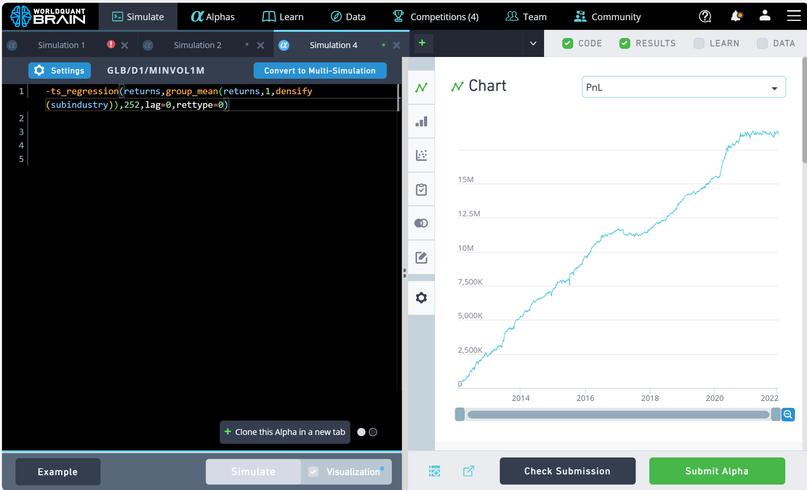

# 2024年华南理工大学量化投资协会技术部测试题

## 前言

欢迎加入华南理工大学量化投资协会!

以下为社团公众号二维码，欢迎在后台联系我们!


华南理工大学量化投资协会创立于2018年，由经济与金融学院于孝建教授指导，旨在凝聚华工量化投资爱好者，为大家搭建信息交汇和经验交流的平台。自创立以来，量协协办了“厚方杯”投资建模邀请赛等多项赛事活动，举办了多次技术沙龙、赛事宣讲以及业界大佬经验分享，有4位社团成员成为WorldQuant Brain研究顾问，多位社团成员进入量化相关邻域就业，并积累了一套宝贵的量化投资回测平台：[scutquant](https://github.com/HaoningChen/ScutQuant)。

在这里，你将收获:

1) 不定期的技术沙龙分享。在技术沙龙中，技术部的同学将分享在量化投资领域的学习心得，带领萌新从Python入门、使用scutquant框架到自主复现研报、开发项目，此外还有🍵、🍰等福利放送。

2) 业界大佬的经验分享。依托于量协前辈以及指导老师于孝建的帮助，量协邀请了众多量化投资领域的大佬进行分享，从他们的分享中，你将了解成为quant的奇妙历程、quant的工作日常以及量化投资前沿发展。

3) 赛事资讯。量协举办过Wrold Quant Brain IQC、“厚方杯”、“郑商所杯”等多次赛事宣讲，通过量协，你将了解到第一手赛事资讯。

4) 志同道合的同伴。量协汇聚了一批技术爱好者以及金融爱好者。在这里，大家可以结识优秀的同伴，共同参与赛事活动，共同成长。

无论你是技术小白，还是量化大佬，我们都希望大家能够感受到量协轻松愉悦不push的氛围，在量协分享知识、收获成长。

## 测试说明

1.无论是否通过本次测试，你都已经成功加入量协。测试仅为技术部录取作为参考，即使未通过测试，也可以进入 __运营部或宣传部__ 。

2.量协干事可选择在加入社团的第二年通过测试选择转入技术部。

3.获得 __60分以上__ 即视为通过测试。

4.我们的题目涵盖了金融知识、技术知识、编程能力考察以及软件配置，这些知识不仅会在量化投资中应用，也会在大家未来将会遇到的课程、赛事以及工作中使用，因此我们希望大家通过完成这些题目能够有所收获。

5.支持使用ChatGPT等生成式AI来辅助学习以及完成任务。但我们希望在使用AI的过程中你可以学到知识，而不只是完成任务。

6.或许你会觉得题目很难，但没关系，我们并不需要你100% 做对，甚至不需要你会做(如果确实不会的，请告诉我们你的完成进度，以及你的思考，我们会给出相应的分数)。我们只是希望从你的回答中看出你对技术的热爱，还有你的技术基础。同时我们希望你花费宝贵的一周并不只是做了道题，而是通过完成任务能够有所收获，这也是出题的初衷。

7.请将测试答案上传至 2404857128@qq.com ，答案的文件格式与组织结构可以自行选择，我们非常欢迎简洁清晰、赏心悦目、富有创造力的答卷。

希望大家不要放弃，尽力而为，与诸君共勉！


## 0 可参考的生成式AI工具

以下仅列举部分作为参考：

[ChatGPT](https://chatgpt.com/)

[kimi](https://kimi.moonshot.cn/)

[文心一言](https://yiyan.baidu.com/welcome)

[通义千问](https://qianwen.aliyun.com/)，注意请不要在使用通义千问时谈论政治话题，以免被封号

## 1 软件与环境配置(50分)
一些可参考的网站:

[vscode+python+jupyter环境搭建_哔哩哔哩_bilibili ](https://www.bilibili.com/video/BV1Ce4y1N7nY/?spm_id_from=333.788.recommend_more_video.0&vd_source=d8812fb45dfb16ea5c50d5afa12af977)

[python零基础教程](https://www.bilibili.com/video/BV1uY411b75q/?p=1&vd_source=d8812fb45dfb16ea5c50d5afa12af977)

[CSDN](https://www.csdn.net/)

[知乎](https://www.zhihu.com/)

[Stack Overflow](https://stackoverflow.com/)

### 1.1 vscode(5分+5分)
1. vscode是一款具有良好的可扩展性的IDE。markdown是一种便捷美观的文本编辑器，适合做笔记。请使用vscode打开本文档并预览，将预览截图上传。

2. 请将本文档以pdf格式导出并上传，pdf越接近预览效果得分越高。请建立并上传一个名为1_1_2.md的文档，并在文档中说明所使用的导出方法。

### 1.2 anaconda(10分)
anaconda是一款用于配置虚拟环境的软件，利用conda环境可以便捷地下载包(package)并实现环境隔离，避免环境污染。下载anaconda并打开jupyter notebook，建立一个名为main.ipynb的jupyter文件，并运行以下代码：

``` python
print("Hello world")
```

完成后，请将main.ipynb上传。

### 1.3 anaconda + pycharm/vscode(20分+10分)
1. 在pycharm或vscode中配置anaconda，注意要先安装anaconda再安装pycharm，否则可能出现python环境冲突的问题。运行附件中[regression.py](files\regression.py)并将程序输出结果以图片或文本文件形式上传。

2. 请解释[regression.py](files/regression.py)的程序内容(可以使用AI辅助理解)，并谈谈这种线性回归方法对量化投资的启示

## 2 量化投资知识理解与运用(70分)

### 2.1 名词解释(12分，1词1分)
本题参考资料:

[Introduction to Alphas](https://platform.worldquantbrain.com/learn/documentation/discover-brain/about-brain-platform),如需注册Brain平台账号，请扫描以下顾问邀请码注册:


[Understand Results \[1/2\]](https://platform.worldquantbrain.com/learn/documentation/discover-brain/intermediate-pack-part-1)

[因子投资](https://github.com/HaoningChen/scutquant/blob/main/%E6%96%87%E4%BB%B6/%E5%9B%A0%E5%AD%90%E6%8A%95%E8%B5%84%EF%BC%9A%E6%96%B9%E6%B3%95%E4%B8%8E%E5%AE%9E%E8%B7%B5%20by%E7%9F%B3%E5%B7%9D%20%E5%88%98%E6%B4%8B%E6%BA%A2%20%E8%BF%9E%E7%A5%A5%E6%96%8C.part1.rar)

根据自己的理解解释以下专业术语(每个1分)：

__1.因子(alpha):__

__2.收益率(return):__

__3.多因子模型:__

__4.回归(regression):__

__5.夏普比率(Sharpe Ratio):__

__6.信息比率(Information Ratio, IR):__

__7.信息系数(Information Coefficient, IC):__

__8.换手率(Turnover):__

__9.RankIC:__

__10.ICIR:__

__11.最大回撤(Max Drawdown):__

__12.分位数组合测试(Group Test):__

### 2.2 关于目标值的探究(15分)

参考资料：

[答读者问](https://mp.weixin.qq.com/s/8k6HxwZTOLQw_LJe38XdSw)

本题中，不妨定义预测准确率如下：

$$accuracy = 1 - \frac{|label_{t+1} - predict_{t+1}|}{label_{t+1}} $$

其中，$$label_{t+1}$$表示t+1时刻的目标值，$$predict_{t+1}$$表示t+1时刻的预测值。请分析以下哪些指标适合作为预测的目标，并阐述原因：

1. 收盘价$$close_{t+1}$$

2. 收益率1(计算公式：$$return_{t} = \frac{close_{t+1}-close_{t}}{close_t}$$),即明天的收盘价相对于今天的收盘价的变化率

3. 收益率2(计算公式：$$return_{t+1} = \frac{close_{t+2}-close_{t+1}}{close_t+1}$$),即后天的收盘价相对于明天的收盘价的变化率

4. 收盘价的对数$$log(close_{t+1})$$

5. 对数收益率(计算公式$${lreturn}_t = log(\frac{close_{t+1}}{close_{t}})$$)

注：本题注重言之有理。在解释合理的情况下，选择任意选项均有可能获得满分。

### 2.3 因子挖掘实践(23分+20分)

1. 本题需借助WorldQuant Brain平台完成，因此请通过2.1的二维码注册账号。

其他参考资料：

[WorldQuant Brain中文论坛](https://support.worldquantbrain.com/hc/en-us/community/posts/19273239621399--Alpha%E7%81%B5%E6%84%9F%E5%90%AF%E7%A4%BA%E5%BD%95-%E5%90%88%E9%9B%86-%E6%8C%81%E7%BB%AD%E6%9B%B4%E6%96%B0%E6%94%B6%E5%BD%95%E4%B8%AD)

WorldQuant Brain平台提供了良好的回测平台、因子表达式以及量化投资学习社区，是学习量化研究的好工具。请在WorldQuant Brain平台构建一个可提交(如下图所示，Submit Alpha按键为绿)的因子，并截图上传(截图需包含因子表达式以及可提交信息，如样例所示)。上传一个表现较好但不可提交的因子也可以在本题得分，但是需要提供相应的测试结果(即PnL及IS Summary)。

提交样例：



2. 请说明你构造的因子中的数据字段含义、操作符及表达式含义、经济学意义(做多具有哪些特征的股票，做空具有哪些特征的股票)。本题给分较宽松，能大致阐明操作意图即可，我们不要求回答出过分超出大一学生认知的内容，例如示例中的滞后项等内容。

答案示例:

__数据字段含义:__

returns: t+1时刻相对t时刻的收益率

subindustry: 子行业

__操作符及表达式含义：__

ts_regression(y,x,d,lag,rettype): 在d日内将y对x回归,滞后由lag给定,在这里不进行滞后处理，返回值类型由rettype给定，在这里返回残差项

group_mean(x,weight,group): 在group分组内按照weight权重计算x的均值，在这里用于计算子行业平均收益率

densify(x): 将group转化为数值，例如industry: tech -> 0, airspace -> 1, ...

表达式含义：取残差收益率的相反数

__经济学意义:__ 做多残差收益率低的股票，做空残差收益率高的股票。残差收益率高的股票可能在过去有过多的超额收益，因此存在反转趋势，所以在未来有更高的补跌概率。

## 3 C++(100分)

建议不修读C++相关课程的同学不做本题

### 3.1 线性回归梯度下降(90分+10分)
1. 梯度下降算法在机器学习中有举足轻重的地位，因此对有志于研究机器学习的同学来说，是非常有必要弄清楚其思想和具体过程的。请参考相关资料，写一个使用 __梯度下降算法的线性回归模型__ （挑战更高难度的，例如逻辑回归甚至浅层神经网络也可）。梯度下降算法部分参考代码如下所示：

```C++
void fit()
{
    int epoch = 0;
    while(check_loss()>0.01)
    {
        for(int i = 0; i < n; ++i)
        {
            forward(i);
            backpropagation(i);
        }
        ++epoch;
        if(epoch==50000) break;
    }
    cout << "epoch=" << epoch <<'\n';
}

void predict()
{
    int pre_num;
    cout << "请输入测试数据量：";
    cin >> pre_num;
    for(int num = 1; num <= pre_num; ++num)
    {
        cout << "请输入测试数据:\n";
        for(int j = 0; j < m; ++j)
        {
            cin >> x[n+1][j];
        }
        cout << "pred:" << dot(n+1) << '\n';
    }
}

void solve()
{
    cout<<"请输入自变量数量:";
    cin>>m;
    cout<<"请输入训练数据量:";
    cin>>n;
    cout<<"请输入训练数据(最后一个为因变量):\n";
    for(int i = 1; i <= n; ++i)
    {
        for(int j = 0; j < n; ++j)
        {
            cin >> x[i][j];
        }
        cin >> y[j];
    }
    fit();
    predict();
}
```

2. 虽然通过上题，你可能已经通过测试了😃。但是你仍然可以思考，学习率过大或过小会造成什么问题，有哪些可能的方法能够解决这些问题。

## 4 Python(60分)

## 4.1 Kaggle(30分+30分)

### 4.1.1 编程/Python 基础

如果你是非计算机相关专业的同学，请完成 https://www.kaggle.com/learn/intro-to-programming 上的课程和练习，并上传证书截图；

如果你是计算机相关专业的同学，请完成 https://www.kaggle.com/learn/python 上的课程和练习，并上传证书截图。

### 4.1.2 pandas 基础

请完成 https://www.kaggle.com/learn/pandas 上的课程和练习，并上传证书截图。
